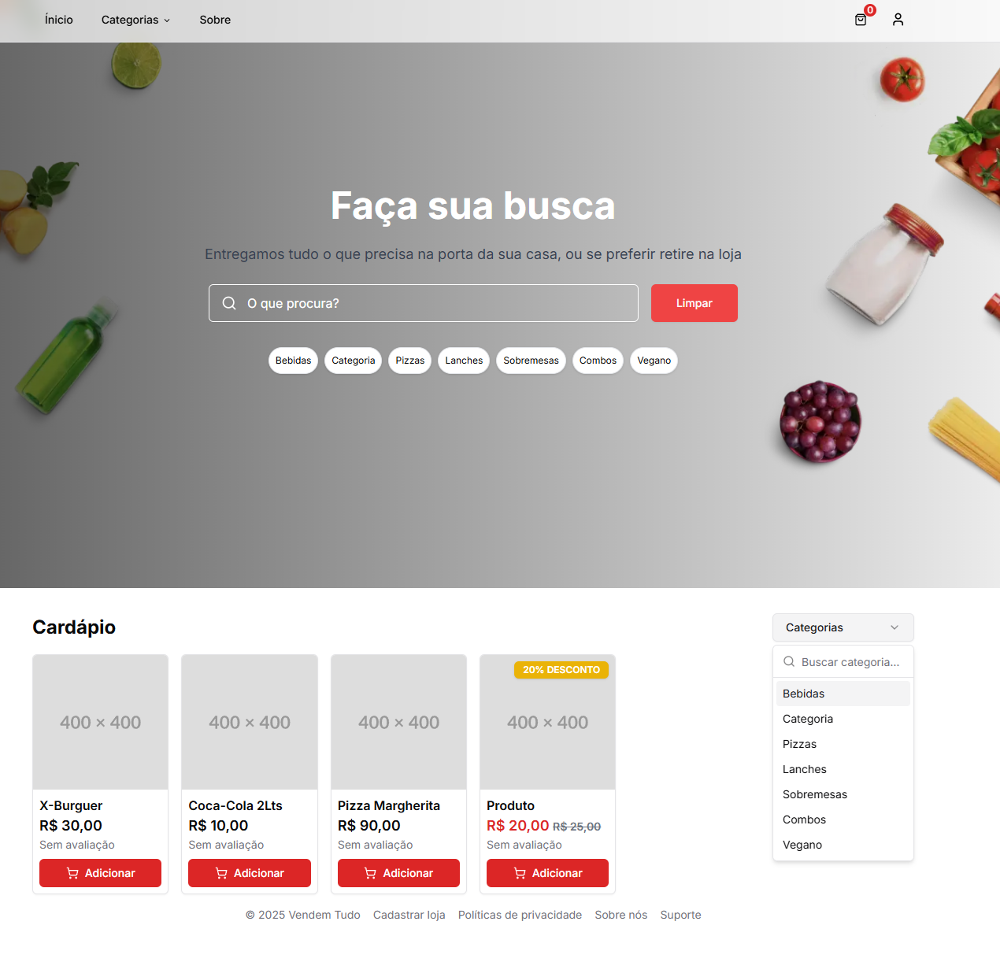

# :desktop_computer: Vendem Tudo



Sistema completo para gestão de vendas, ideal para aplicações modernas com integração a diversos serviços em nuvem e autenticação segura.

## :rocket: [Vendem Tudo](https://vendem-tudo.vercel.app/)

## :fire: Run

- Database (Postgres): `docker compose up -d`
- Install: `yarn && yarn db:push && yarn db:seed`
- Development (Port 3000): `yarn dev`
- Build: `yarn build`

## :triangular_flag_on_post: Environment Variables

- Batabase: `DATABASE_URL`

- URL: `NEXT_PUBLIC_APP_URL`

- Secret: `AUTH_SECRET`

- Resend Key: `RESEND_API_KEY`

- Cloudinay name: `CLOUDINARY_CLOUD_NAME`
- Cloudinary Key: `CLOUDINARY_API_KEY`
- Cloudinary Secret: `CLOUDINARY_API_SECRET`
- Cloudinary Variable: `CLOUDINARY_ENV_VARIABLE`

## :test_tube: Test

Você pode utilizar os seguintes dados para acessar o sistema após executar o seed:

- Email: dono@email.com
- Senha: pass123ASD

## :globe_with_meridians: Routes

Rota base da plataforma de administração/gestão, voltada para clientes autenticados (como donos de lojas):

```

  /plataforma/
  ├── page.tsx                      # Dashboard principal
  ├── alimentos/
  │   └── page.tsx                  # Lista de alimentos
  │   └── categorias.tsx            # Categorias de alimentos
  ├── clientes/
  │   └── page.tsx                  # Gestão de clientes
  ├── conta/
  │   └── page.tsx                  # Dados da conta
  ├── pedidos/
  │   └── page.tsx                  # Histórico e gestão de pedidos
  ├── seguranca/
  │   └── page.tsx                  # Configurações de segurança (senha, autenticação etc.)

```

Acesso livre para visitantes e novos usuários da plataforma:

```

  /
  ├── page.tsx                      # Landing page pública
  ├── entrar.tsx                    # Login de usuários
  ├── planos.tsx                    # Página de planos/assinaturas
  ├── politicas-de-privacidade.tsx  # Política de privacidade
  ├── termos-de-uso.tsx             # Termos de uso
  ├── sobre-nos.tsx                 # Sobre a empresa/plataforma
  ├── suporte.tsx                   # Ajuda/suporte
  ├── recuperar-senha.tsx           # Solicitação de recuperação de senha
  ├── redefinir-senha.tsx           # Redefinição com token

```

Área pública e autenticada de cada loja individual:

```

  /loja/[slug]/
  ├── index.tsx                    # Página principal da loja (vitrine, produtos etc.)

  ├── cadastrar.tsx                # Cadastro de cliente
  ├── entrar.tsx                   # Login de cliente
  ├── manutencao.tsx              # Loja temporariamente fora do ar
  ├── recuperar-senha.tsx         # Início da recuperação de senha
  ├── refefinir-senha.tsx         # Redefinição com token
  ├── verificar-email.tsx         # Verificação de e-mail após cadastro

  ├── conta/
  │   └── index.tsx               # Painel do cliente (dados pessoais, resumo)
  │   └── pedidos.tsx             # Histórico de pedidos
  │   └── seguranca.tsx           # Alteração de senha e autenticação

```

Erros:

```

  /error.tsx                         # Página genérica de erro (problemas do servidor, API etc.)
  /not-found.tsx                     # Página 404 personalizada (rota não encontrada)

```

## :copyright: Author

<a href="https://github.com/higoreduardob">
  <br>
  <sub><b>Higor Eduardo</b></sub>
</a>

Desenvolvido com :heart: por **Higor Eduardo** — [higoreduardob](https://github.com/higoreduardob)